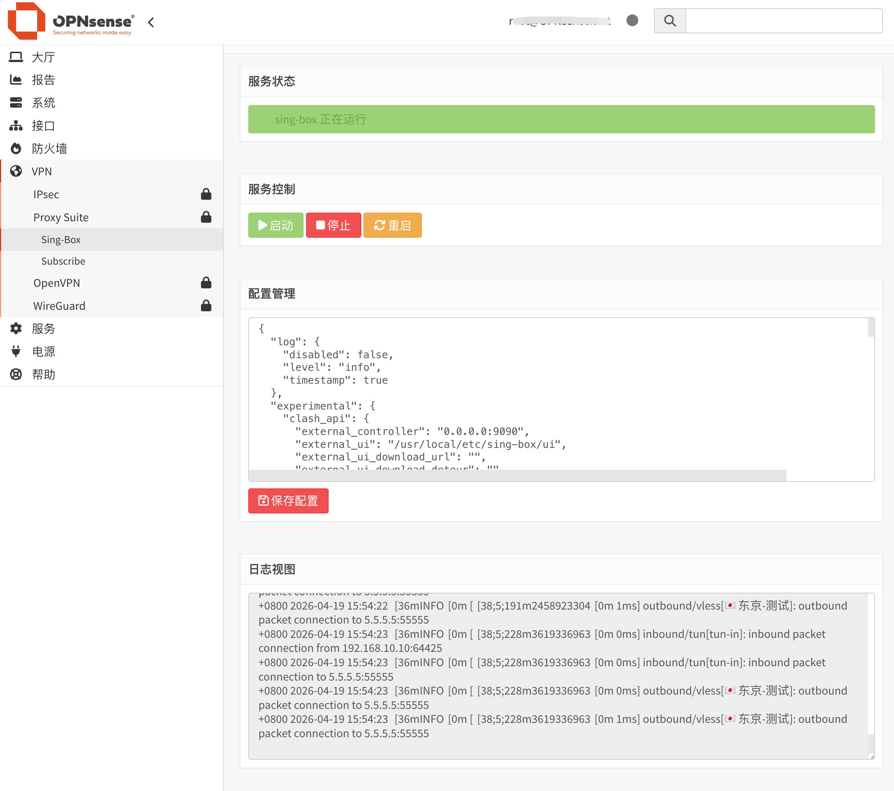
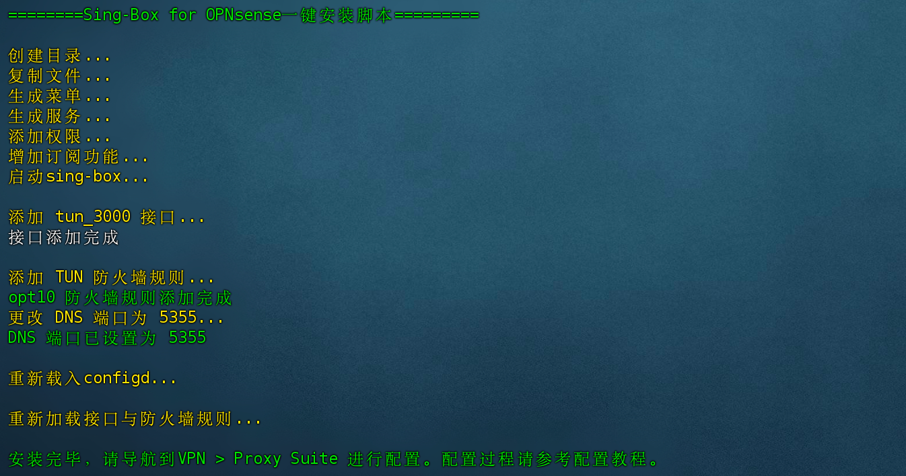

## Sing-box for OPNsense
sing-box安装工具，在OPNsense上实现透明代理功能。在OPNsense 25.7上测试通过。



## 程序版本
[Vincent-Loeng大佬魔改Sing-Box](https://github.com/Vincent-Loeng/sing-box) 

## 注意事项
1. 当前仅支持x86_64 平台。
2. 脚本不提供任何节点信息，请准备好自己的出站配置文件。
3. 脚本会自动添加tun接口、防火墙规则，并开启DoT转发。
4. 脚本集成配置模板，只需补充出站部分的配置部分配置即可使用。
5. 由于sing-box不同版本的配置有差异，已发布Release的配置文件只针对安装程序的版本。
6. 为减少长期运行保存的日志数量，在调试完成后，请将配置的日志类型修改为error或warn。

## 安装命令

```bash
sh install.sh
```


## 卸载命令

```bash
sh uninstall.sh
```

## 配置步骤
1. 安装完成，导航到VPN>Proxy Suite>Sing-Box，修改sing-box出站（ outbounds到route部分) 内容并保存。
2. 点击启动或重启按钮，转到接口>分配，将tun_3000虚拟网卡添加为接口并启用，无需输入IPv4地址和网关。
3. 在系统>设置>常规添加两个DoT DNS，一个国内一个国外。
4. 转到服务>Unbound DNS>DoT，选中启用DoT选项并应用。
5. 转到防火墙>规则，在tun接口添加一条any to any防火墙规则，允许tun子网访问。
6. 设置完成，客户端访问 ip111.cn，检查分流是否正常。

## 其他事项
1. 默认配置文件开启了clash api功能，访问 http://lan_ip:9090/ui 登录仪表盘查看代理连接信息。
2. 订阅转换可以设置定时任务自动更新。转到系统>设置>任务，添加”sing-box update sub”任务项即可。
